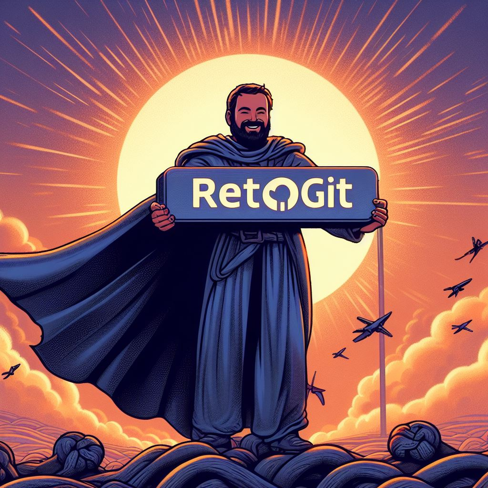

# Proceso de Creación del Repositorio RetoGit

¡Hola a todos!

Recientemente creé un nuevo repositorio para un reto. Aquí está cómo lo hice:

## Proceso de Gestión del Repositorio "retogit"

### 1. Crear un Repositorio Nuevo:
   - Haz clic en el botón verde "New".
   - Ingresa el nombre "retogit", selecciona "Public" y añade una descripción.
   - Marca la casilla "Add a README file", y deja las opciones "None" tanto para `.gitignore` como para "Choose a license".
   - Finalmente, haz clic en el botón verde "Create repository".

### 2. Subir la Carpeta "src" de un Proyecto en Java:
   - Ubica la carpeta "src" del proyecto.
   - Dentro del repositorio "retogit", haz clic en "Add file" y selecciona "Upload files".
   - Arrastra la carpeta "src" a la zona que dice "Drag files here to add them to your repository".
   - En el área "Commit changes", agrega una descripción y haz clic en el botón verde "Commit changes".

### 3. Crear una Nueva Rama llamada "desarrolloPersona":
   - En la página principal del repositorio, haz clic en "main".
   - Escribe "desarrolloPersona" en el cuadro de búsqueda.
   - Selecciona "Create branch desarrolloPersona from main" y haz clic para crear la nueva rama.

### 4. Descargar el Contenido de la Rama a tu Repositorio Local:
   - Abre GitHub Desktop y conecta tu cuenta.
   - Selecciona el repositorio "retogit" y haz clic en "Clone".
   - En la pestaña "GitHub.com", selecciona "retogit" y haz clic en "Clone".
   - En "Current branch", elige la rama "desarrolloPersona".
   - No hay cambios para descargar si las ramas no tienen diferencias.

### 5. Crear una Clase Nueva y Actualizar la Rama en el Repositorio:
   - Crea una nueva clase llamada "Biblioteca".
   - En GitHub Desktop, haz clic en "Commit to desarrolloPersona" y luego en "Push Origin" para subir los archivos al repositorio en línea.

### 6. Modificar un Atributo de la Clase Nueva y Actualizar la Rama en el Repositorio:
   - Modifica un atributo de la clase.
   - En GitHub Desktop, haz clic en "Commit to desarrolloPersona" con la descripción adecuada y luego en "Push Origin" para subir los cambios.

### 7. Comprobar los Cambios:
   - En la rama "desarrolloPersona", verás los commits con sus respectivos cambios.

### 8. Fusionar la Rama "desarrolloPersona" con la Rama Principal "main":
   - Desde la rama "desarrolloPersona", haz clic en "Contribute" y selecciona "Open full request".
   - Agrega un título y una descripción, luego haz clic en "Create pull request" y finalmente en "Merge pull request".

## Mi Proyecto

[retogit](https://github.com/slyder83/retogit)
